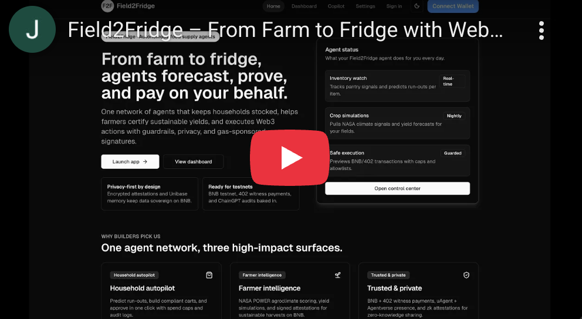

# Field2Fridge

Field2Fridge is an autonomous Web3 agent network on **BNB Chain** that keeps **household pantries** stocked and gives **farmers** a climate-aware on-chain identity.

[](https://youtu.be/IV46gxrNJew)

- Household side: Akedo-style grocery agent that tracks pantry inventory, enforces budgets and vendor allowlists (Amazon/Walmart simulated), and auto-approves carts with audit logs.  
- Farmer side: SpaceAgri-aligned field simulations using **NASA POWER Agroclimatology** daily data to derive climate risk scores per field.  
- Copilot: **ChainGPT** research + smart-contract audit + 402-style pay-per-execute flow with spend caps and contract allowlists.  
- Agentverse: **ASI/Fetch** uAgent (Field2FridgeASI) powered by **ASI-1 Mini** so the same logic lives in Agentverse as well as the Next.js app.  
- Payments: Custom **HTTP 402** gateway with an EIP-712 witness → signature → execution flow for BNB testnet transactions.

**Demo + Live App**

- YouTube: https://youtu.be/IV46gxrNJew  
- Live app: https://field2-fridge.vercel.app/

---

## Hackathons & Tracks

Built for the **UK AI Agent Hackathon EP3 by ASI** with alignment to sponsor tracks:

### Akedo – AI Robot Shopping Assistant
- Household workspace at `/household/pantry`, `/household/cart`, `/household/controls`.
- Tracks items with avg daily use → computes days-left risk (Comfortable/Watch/Critical).
- Enforces weekly budgets, per-order caps, and vendor allowlists (Amazon/Walmart simulated).
- Auto-cart proposes refills under caps; approvals logged in Convex with cart payloads.

### Quack × ChainGPT – Super Web3 Agent
- `/copilot` page is a ChainGPT Web3 assistant:
  - Research tab hits ChainGPT’s Web3 LLM for explanations/risk notes.
  - Audit tab calls the Smart Contract Auditor for registry/token reviews.
  - Execute tab uses a **402 flow**: first call returns `HTTP 402` + EIP-712 witness; client signs via wagmi and resubmits `{ tx, witness, signature }`; gateway enforces caps/allowlists then simulates or sends the tx.
- Safety: global USD caps, contract allow/deny lists, and ChainGPT risk summaries before execution.

### SpaceAgri – AI Agriculture Agent with Open Agro Data
- `/farmer/fields` calls **NASA POWER Daily API (community=AG)** to fetch temperature/rainfall and compute climate risk per field.
- Stores simulation outputs per wallet/field in Convex and surfaces history and outlooks.

### BNB Chain Prize
- On-chain actions run on **BNB Smart Chain Testnet**:
  - `Field2FridgeAgentRegistry` (ERC-8004 style) mints an NFT per agent via `register`.
  - `Field2FridgeServiceToken` (ERC-20) as the service/payment token.
- Wallet layer: RainbowKit + wagmi + viem with addresses injected via env.

### ASI / Fetch / Agentverse
- `agents/field2fridge_agent/agent.py` defines **Field2FridgeASI** (uAgents) using **ASI-1 Mini** through ASI:One.
- Publishes Chat Protocol and registers with Almanac; listens for `/cart_decision` posts from the app so household approvals are visible to the agent.

---

## Stack

- **Frontend**: Next.js 15 (App Router), TypeScript, Tailwind CSS, shadcn/ui.
- **Wallets**: RainbowKit + wagmi + viem (BNB testnet/mainnet).
- **Backend state**: Convex (profiles, pantry, controls, carts, audit logs, farmer sims).
- **Agents / AI**: ChainGPT Web3 LLM + Auditor; ASI-1 Mini via ASI:One for the uAgent.
- **On-chain**: BNB testnet contracts (agent registry + service token).
- **Payments**: Express 402 gateway with EIP-712 witness signing.

---

## App Surfaces

- **Household**
  - `/household/pantry` — inventory + days-left risk.
  - `/household/controls` — budgets, per-order cap, vendor allow/deny, approval mode.
  - `/household/cart` — auto-cart, approve/decline with audit logging.
- **Farmer**
  - `/farmer/fields` — field planner using NASA POWER climate signals; stores results/history.
- **Copilot**
  - `/copilot` — ChainGPT research, smart-contract audit, and 402-gated execution with tx previews and risk warnings.
- **Settings**
  - `/settings` — network toggle, global USD caps, contract allow/deny lists, telemetry/warnings.

---

## Quick Start

```bash
pnpm install

# Convex dev (Terminal 1)
pnpm run convex:dev

# Next.js dev (Terminal 2)
pnpm dev

# ASI uAgent (Terminal 3, optional but recommended)
cd agents/field2fridge_agent
python -m venv .venv   # once
source .venv/bin/activate
pip install -r requirements.txt
python agent.py

# 402 gateway (Terminal 4, for Execute demo)
pnpm run payments:dev
```

Open `http://localhost:3000`.

---

## Required Environment

Set these in `.env.local` for Next.js (and `.env` for the Python agent):

**Next.js / Convex / BNB**
- `NEXT_PUBLIC_WALLETCONNECT_PROJECT_ID`
- `NEXT_PUBLIC_CONVEX_URL`
- `NEXT_PUBLIC_AGENT_REGISTRY_ADDRESS`
- `NEXT_PUBLIC_SERVICE_TOKEN_ADDRESS`
- `CHAINGPT_API_KEY`
- (optional) `Q402_GATEWAY_URL` (default `http://localhost:4020`)

**Payments gateway (402 flow)**
- `Q402_PORT` (default `4020`)
- `Q402_RPC_URL` (e.g., `https://bsc-testnet.publicnode.com`)
- `Q402_NETWORK` (`BSC_TESTNET` or `BSC_MAINNET`)
- `Q402_SIGNER_PRIVATE_KEY` (omit to simulate txs)
- `Q402_TOKEN_ADDRESS` (service token)
- `Q402_RECIPIENT_ADDRESS` (payment recipient)

**ASI / Fetch uAgent** (`agents/field2fridge_agent/.env`)
- `ASI1_API_KEY`
- `FIELD2FRIDGE_SUBJECT`
- `AGENT_SEED_PHRASE`

NASA POWER needs **no API key**.

---

## 402 Gateway (x402-style)

`payments/server.ts` implements a two-phase HTTP 402 flow:
1) Client posts `tx` without witness/signature → responds `402 Payment Required` with `paymentDetails` (token, amount, networkId, EIP-712 witness).  
2) Client signs the witness via wagmi `signTypedData` and resubmits `{ tx, witness, signature }` → gateway verifies signature, enforces caps/allowlists, and simulates or sends the BNB testnet transaction.

---

## Testing

- `pnpm typecheck`
- `pnpm lint`
- `pnpm build`

Run these before demos to ensure Convex schema, routes, and types are clean.
